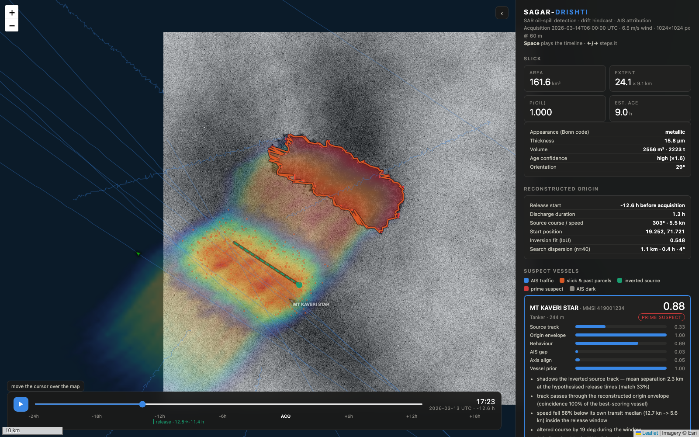

# OILTRACE

**Maritime Oil Spill Intelligence & Vessel Attribution Command Center.**

Smart India Hackathon 2026 · **SIH26143** · NTRO · Disaster Management.

Full command center on top of the SAGAR-DRISHTI physics engine- pipeline as
before, plus jurisdiction lookup (India EEZ + MARPOL Special Areas), an alert
engine, patrol recommendations, per-incident evidence packs (JSON/GeoJSON/CSV
with provenance chain), a source-registry with per-provider health, and a
MapLibre-GL command center with a scenario picker, live SSE progress bar,
5-tab intelligence side-panel and 6 replay scenarios.

**Run:** `python -m oiltrace.server --port 8000 --warm` → http://127.0.0.1:8000/

Full inventory of what's real vs stubbed vs deferred against the 72-section
spec: [docs/OILTRACE.md](docs/OILTRACE.md).

---

# SAGAR-DRISHTI

**Oil spill detection from SAR, drift hindcasting, and vessel attribution from AIS.**

Smart India Hackathon 2026 · Problem Statement **SIH26143** · National Technical
Research Organisation (NTRO) · Theme: Disaster Management

An automated pipeline that takes a SAR scene and an AIS feed and answers three
questions: *is that dark patch oil?*, *where and when did it come from?*, and
*which ship put it there?*- with the reasoning behind each answer written out
so an analyst can audit it.

---

## Quickstart

```bash
python3 -m venv .venv && .venv/bin/pip install -r requirements.txt

.venv/bin/python scripts/run_demo.py      # full pipeline, ~30 s
.venv/bin/python scripts/serve.py         # dashboard at http://127.0.0.1:8000
```

Other entry points:

```bash
.venv/bin/python tests/test_pipeline.py             # 10 unit tests, ~20 s
.venv/bin/python scripts/validate.py --seeds 10     # batch validation, ~6 min
.venv/bin/python scripts/train_classifier.py --scenes 45   # refit the discriminator
.venv/bin/python scripts/export_ais.py              # MarineCadastre-format AIS CSV
```

No API keys, no GPU, no geospatial stack- five pure-Python wheels
(numpy, scipy, pillow, fastapi, uvicorn).

---

## What it does

**1 · Detect.** Refined-Lee speckle filtering and incidence-trend removal, then
multi-scale adaptive thresholding (deliberately over-detecting), then an
8-feature logistic discriminator that separates mineral oil from the look-alikes
that defeat a bare threshold- low-wind cells and biogenic films. The features
are the classical physical ones: contrast, edge sharpness, shape complexity,
internal homogeneity, local wind.

**2 · Characterise.** Bonn Agreement appearance class and thickness from damping
contrast; volume and tonnage; and **three independent age estimators**-
advective (a slick is a trail: length ÷ drift speed), Fay gravity-viscous
spreading, and weathering-driven contrast decay. They are fused in log space and
their *disagreement* is reported as the uncertainty, rather than hidden.

**3 · Hindcast and forecast.** An RK2 Lagrangian ensemble- currents + windage +
Stokes drift + turbulent random walk- run backwards to a space-time origin
probability field and forwards to a drift projection. Windage is perturbed per
particle (3.0% ± 0.6%), because it is the dominant uncertainty for surface oil.

**4 · Invert the source.** *This is the part that makes the attribution work.*
A backward particle cloud cannot localise this kind of spill: an operational
discharge from a vessel underway is a **line source**, its along-track extent
was there at t=0, and running it backwards never collapses it. Measured here:
backward spread contracts by under 2% over 26 hours, and the backward-PDF peak
lands **13.9 km** from the true origin on average.

So instead of inverting the cloud, we invert the source- hypothesise
`(t_start, duration, course, speed, x₀, y₀)`, forward-advect that moving line
through the same metocean fields, and score the footprint against the observed
slick by IoU. That halves the position error and, more importantly, produces a
**candidate source track** to match against AIS in space *and* time.

**5 · Attribute.** Reconstruct traffic from AIS, filter out vessels that can't
be scored, and rank the rest on six evidence axes:

| Axis | Weight | What it measures |
|---|---|---|
| Source-track match | 3.2 | AIS track vs the inverted source line, sampled at the release times |
| Origin envelope | 2.4 | AIS track integrated against the backward origin PDF |
| Behaviour | 1.6 | speed drop vs the vessel's own median, course alteration, loitering |
| AIS dark period | 1.2 | transponder gap overlapping the release window |
| Axis alignment | 1.0 | vessel course vs the slick's major axis |
| Vessel prior | 0.7 | type, length, draft |

Additive log-odds through a sigmoid, and every term ships with a sentence of
justification. The prior carries the smallest weight by design: it must never be
able to convict on its own.

**6 · Present.** A Vite + React + Tailwind operations dashboard (`frontend/`- Outfit, white/light-grey grid): SAR σ⁰, detected slick, origin
probability field, AIS traffic, the inverted source track, a scrubbable
hindcast↔forecast timeline, and ranked suspect cards with their evidence. MapLibre GL, fully responsive.



---

## Results

Ten independent scenarios (`scripts/validate.py --seeds 10`)- every seed
regenerates the metocean fields, slick geometry, discharge timing, look-alike
population and traffic picture, so these are repeated measurements, not one
lucky scene.

| Metric | Mean | Median | Worst |
|---|---|---|---|
| Segmentation IoU | 0.699 | 0.735 | 0.439 |
| Segmentation F1 | 0.813 |- |- |
| **Attribution accuracy** | **10 / 10** |- |- |
| Top-1 score margin over runner-up | 0.52 |- | 0.29 |
| Origin position error (inversion) | 9.4 km | 9.6 km | 17.0 km |
| Origin position error (backward PDF alone) | 13.9 km |- |- |
| Release time error | 198 min | 185 min |- |
| Source course error | 21° |- |- |
| Runtime per scenario | 32 s |- |- |

On the reference scenario (seed 11) the pipeline recovers the origin to **2.2 km
/ 23 min / 9°** and separates the true polluter from the runner-up by **0.88 vs
0.13**.

The three decoy vessels exist to make that number mean something. A
proximity-only scorer convicts the nearest ship, so the traffic picture contains
one that was in the right place at the wrong time, one in the right time at the
wrong place, and one that transited the origin at the right moment behaving
perfectly normally. Ranking is only evidence of attribution if those are ranked
below the polluter- they are.

---

## Honest limitations

The prototype is trained and validated on **simulated** scenes. The simulator
implements the right physics- Bragg damping with a CMOD-like wind background,
Gamma speckle at Sentinel-1's ENL, incidence trend across the swath, low-wind
cells and biogenic films- and the ground truth is derived by *the same drift
physics the pipeline then inverts*, so origin recovery is a fair test with a
known answer. But:

- **The classifier separates the simulated classes perfectly (test AUC 1.000 on
  195 candidate regions).** That number will not survive contact with the Zenodo
  test split, and it should not be quoted as if it would. Real look-alikes are
  far more varied. `sagar/data/loaders.py` + the existing feature path is the
  migration route, not a rewrite.
- **The reported search dispersion is not a calibrated error bar.** The
  optimiser converges tightly (~1 km) onto answers that can be 17 km wrong,
  because the forward map is only weakly identifiable along the drift direction.
  Tripling the search budget raises fit IoU from 0.56 to 0.61 and leaves the
  position error unchanged- that is a modelling limit, not a search limit. Read
  a *wide* dispersion as "distrust this inversion"; do not read a narrow one as
  confirmation.
- Single-polarisation intensity only. VH and polarimetric features
  (entropy/alpha, co-pol phase difference) are the standard next lever.
- No land or ice masking; analytic metocean fields rather than CMEMS/ERA5.
- Rankings are **investigative leads**, not findings of guilt. Enforcement under
  MARPOL Annex I requires corroboration- typically oil fingerprinting against a
  sample taken at port state inspection.

---

## Moving to operational data

Everything algorithmic depends on exactly two interfaces, which is why this is a
configuration change rather than a rewrite:

```python
scene.sigma0_db                 # ndarray, dB
scene.latlon_of_pixel(r, c)     # → (lat, lon)
ocean.sample_xy(t, x, y)        # → (u_cur, v_cur, u_wind, v_wind)
```

| Source | Adapter |
|---|---|
| Zenodo Sentinel-1 oil-spill dataset (labelled TIFFs) | `loaders.load_zenodo_tiff` |
| Sentinel-1 GRD GeoTIFF (georeferenced) | `loaders.load_geotiff` |
| CMEMS currents + ERA5 winds | `loaders.NetCDFOcean` |
| MarineCadastre / real AIS CSV | `ais.load_csv` |

Dataset links, model references and the reasoning behind each design choice are
in **[docs/research.md](docs/research.md)**; the module map and the decisions
worth defending are in **[docs/architecture.md](docs/architecture.md)**.

---

## Repository layout

```
sagar/core/     geoutil · environment · sarsim · scenario · detect
                characterize · drift · inversion · ais · attribute · pipeline
                dark_vessel · narrative · incois · mv_rak
sagar/data/     loaders.py (real-data adapters) · oil_classifier.json
sagar/api/      export.py (report.json + PNG overlays)
frontend/       Vite + React + TypeScript + Tailwind (Outfit, white/light-grey, grid)
                src/components/*  MapLibre GL, responsive
scripts/        run_demo · serve · validate · train_classifier · export_ais
tests/          test_pipeline.py  test_new_features.py
docs/           architecture.md · research.md · OILTRACE.md
```
