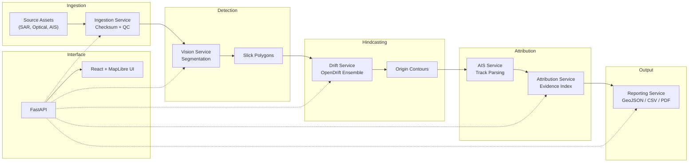

# OilTrace — Architecture

## System Overview

OilTrace is a satellite oil-spill detection, drift hindcasting, and AIS-based vessel attribution platform.



## Data Flow

1. **Ingestion** — Analyst registers source assets (Sentinel-1 SAR, AIS data). System computes checksums for immutability.
2. **Detection** — Vision service runs segmentation model on SAR imagery, producing binary oil-slick masks vectorised to GeoJSON polygons.
3. **Review** — Analyst accepts, rejects, or marks slicks as uncertain.
4. **Drift Hindcasting** — Backward-in-time particle ensemble generates origin-probability contour polygons.
5. **AIS Analysis** — AIS positions are parsed, quality-controlled, and segmented into continuous tracks.
6. **Attribution** — Candidate vessels are gated by proximity to origin contours, then scored using the evidence index formula.
7. **Export** — Frozen report bundle (GeoJSON + CSV + PDF) for downstream use.

## Attribution Scoring

```
R(v) = 100 × q_case × q_ais(v) × (0.35 × s_space + 0.25 × s_time + 0.25 × s_fit + 0.15 × s_beh)
```

> **IMPORTANT**: The output is an **evidence index**, not a probability or guilt determination.

## Technology Stack

| Layer | Technology |
|-------|-----------|
| API | FastAPI (Python) |
| Data Store | DuckDB + Parquet |
| Geospatial | Shapely, pyproj |
| Drift Model | OpenDrift/OpenOil (stubbed) |
| UI | React + MapLibre GL JS (Vite) |
| Testing | pytest + httpx |
